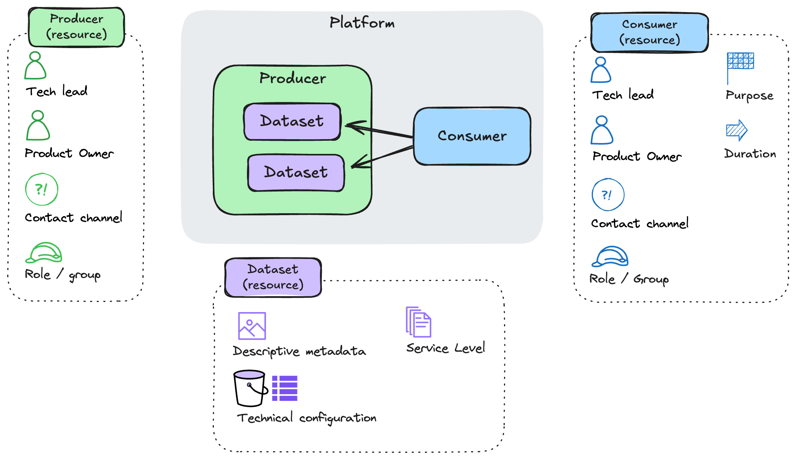

# 🛍️ Shopkeeper
Shopkeeper is a python package that implements Data Platform Resources -- data producers, data consumers and datasets -- as custom infrastructure components.
This project is in its early phases, exploring whether Pulumi can provide a rich self service interface to a data platform.

See [honestgrowth.no](https://honestgrowth.super.site/essays/building-the-marketplace) for strategy and design.



## Trying out the marketplace
Coming soon! For now, you can peek at the test cases in [pulumi-shopkeeper/tests](./pulumi-shopkeeper/tests).

## Contributor setup

Prerequisites:
* Docker
* (recommended) Visual Studio Code, with the [Dev Containers](https://marketplace.visualstudio.com/items?itemName=ms-vscode-remote.remote-containers) extension
* A test AWS subscription (`aws sso login`)

This project can be tested and developed in a (rather opinionated) devcontainer based on the (rather large) Pulumi/Pulumi image. This image gives us Java, Go, dotnet and python, which we need to build and test pulumi packages across all supported languages.

To get started, build the container yourself, providing your own github handle as an arg. This will be used to create a non-root container user, and is later by the devcontainer configuration.
```sh
export GITHUB_USERNAME="jaketbouma"
cd .devcontainer
docker build -f dev.Dockerfile --build-arg GITHUB_USERNAME=$GITHUB_USERNAME$ -t shopkeeper-dev:latest ./
```

Review the `.devcontainer/devcontainer.json` file. I use [chezmoi](https://www.chezmoi.io/) to sync dotfile configuration and secrets into the development container using a postStartCommand script. This is mostly for terminal cosmetics and to persist terminal history. You can create your own `.devcontainer/${GITHUB_USERNAME}.postStartCommand.sh` and adjust as needed.

Poetry Poe is used as the task runner, and has tasks for tests, cleanups, etc.
```sh
cd pulumi-shopkeeper
poetry install
poetry run poe
```

Happy hacking!